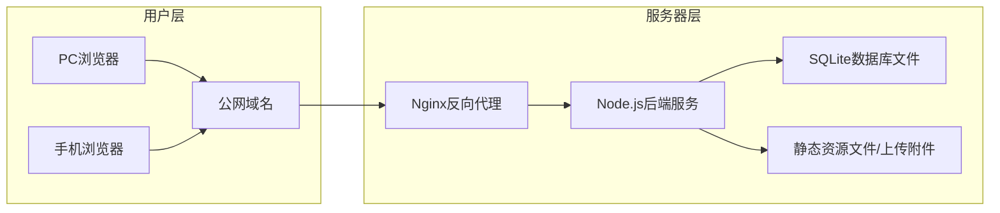

# 中国本土情侣婚嫁全流程协同管理Web应用设计文档

## 1. 项目概述
### 1.1 产品定位
专为中国情侣设计的婚嫁全流程协同管理工具，覆盖从确定结婚意向到婚礼结束的完整生命周期，支持双人实时协作，本土化适配国内婚嫁习俗。

### 1.2 核心特点
- 时间线驱动的流程管理
- 节点级独立功能隔离
- 双人实时协同同步
- 本土化习俗适配
- 响应式多端适配
- 轻量化Docker一键部署

## 2. 技术架构
### 2.1 技术栈选型
- **前端**：React 18 + TypeScript + Tailwind CSS + Ant Design Mobile
- **后端**：Node.js + Express + TypeScript
- **数据库**：SQLite 3（单文件嵌入式数据库）
- **部署**：Docker 镜像 + Nginx 反向代理
- **文件存储**：本地磁盘存储（支持Docker卷持久化）

### 2.2 部署架构


### 2.3 部署特性
- Docker镜像包含所有依赖，一行命令即可启动
- 数据持久化支持挂载主机目录，方便备份迁移
- 内置Nginx处理静态资源和HTTPS配置
- 支持HTTP/HTTPS访问，兼容手机/PC浏览器

## 3. 核心功能模块

### 3.1 时间线主模块
**核心功能：**
- 内置9个标准婚嫁节点：
  1. 确定结婚意向
  2. 双方父母见面
  3. 男方上门提亲
  4. 彩礼嫁妆三金协商
  5. 订婚仪式
  6. 婚前筹备
  7. 民政局领证
  8. 婚礼举办
  9. 婚后费用结算收尾
- 支持完全自定义节点：增删改节点名称、描述、截止日期，拖拽调整顺序
- 节点状态管理：未开始/进行中/已完成/已取消，支持手动和自动流转
- 全局进度展示：整体完成百分比，各节点状态可视化
- 响应式布局：PC端左右布局（左侧时间线+右侧详情），移动端上下布局

### 3.2 节点详情模块
每个节点独立包含5大功能区：
1. **待办事项清单**
   - 内置本土化待办模板：彩礼、嫁妆、三金、婚宴、婚庆、婚车、婚纱、酒店等
   - 支持自定义添加/编辑/删除待办，标记完成状态，设置负责人
   - 待办批量操作，导入导出功能

2. **费用收支记录**
   - 分类记录：收入（彩礼、礼金等）/支出（婚宴、婚庆等），支持自定义分类
   - 自动计算节点收支结余，支持按时间、分类筛选
   - 支持导出Excel报表

3. **备忘录**
   - 富文本编辑，支持插入链接、表格、列表等
   - 自动保存版本历史

4. **照片附件管理**
   - 支持上传票据、合同、聊天记录截图等常见格式
   - 图片预览、下载、批量管理功能
   - 文件大小限制：单文件最大10MB

5. **节点操作**
   - 标记完成/取消/重新开始
   - 修改节点基本信息
   - 节点数据导出功能

### 3.3 双人协同模块
1. **账号绑定**
   - 生成唯一6位邀请码，另一方输入即可绑定配对
   - 支持解绑、更换绑定账号功能
   - 绑定后自动同步所有历史数据

2. **实时同步**
   - 所有节点、待办、费用、附件数据实时双向同步
   - WebSocket推送更新，无需手动刷新
   - 操作日志记录，显示操作人、操作时间、操作内容

3. **权限控制**
   - 双方权限完全平等，均可编辑、删除、添加所有内容
   - 支持设置待办负责人，明确分工
   - 重要操作二次确认机制

### 3.4 全局统计模块
1. **进度可视化**
   - 整体完成百分比环形图
   - 各节点状态占比饼图
   - 时间进度与实际完成进度对比

2. **费用统计**
   - 总收支、结余统计
   - 各节点费用占比柱状图
   - 分类费用统计（婚宴、三金、婚庆等维度）
   - 费用趋势图，按月/按节点统计

3. **待办统计**
   - 总待办数、已完成数、完成率
   - 逾期待办提醒
   - 按负责人统计待办完成情况

### 3.5 系统设置模块
1. **账号管理**
   - 修改密码、退出登录
   - 绑定/解绑情侣账号
   - 登录设备管理

2. **数据管理**
   - 手动备份数据库，一键导出全量数据压缩包
   - 从备份文件恢复数据
   - 清空所有数据功能（二次确认）

3. **自定义配置**
   - 自定义待办分类、费用分类
   - 设置默认提醒方式
   - 时间线节点模板重置，恢复默认节点设置

## 4. 数据模型设计
### 4.1 核心表结构
1. **users 用户表**
   - id, username, password_hash, email, created_at, updated_at, last_login
   - invite_code, partner_id, is_activated

2. **timeline_nodes 时间线节点表**
   - id, user_id, name, description, status, order, deadline, created_at, updated_at
   - status: pending, in_progress, completed, cancelled

3. **todo_items 待办事项表**
   - id, node_id, user_id, content, status, assignee_id, deadline, created_at, updated_at
   - status: pending, completed, cancelled

4. **expense_records 费用记录表**
   - id, node_id, user_id, type, amount, category, description, created_at, updated_at
   - type: income, expense

5. **memos 备忘录表**
   - id, node_id, user_id, content, created_at, updated_at

6. **attachments 附件表**
   - id, node_id, user_id, file_name, file_path, file_size, file_type, created_at

7. **operation_logs 操作日志表**
   - id, user_id, operation_type, target_type, target_id, content, created_at

## 5. 非功能需求
### 5.1 性能要求
- 页面加载时间 < 2s
- 接口响应时间 < 500ms
- 支持1000+待办事项、1000+费用记录流畅运行
- 图片上传速度 < 2s（10MB以内）

### 5.2 安全要求
- 密码BCrypt加密存储
- JWT token身份验证
- 上传文件类型校验，防止恶意文件上传
- SQL注入防护
- XSS攻击防护
- 重要操作二次确认机制

### 5.3 数据可靠性
- 数据库每日自动备份
- 支持手动一键备份恢复
- 上传文件自动校验完整性
- 删除操作软删除，可恢复

### 5.4 兼容性
- 浏览器支持：Chrome 90+, Firefox 88+, Safari 14+, 微信内置浏览器
- 移动端适配：iOS 14+, Android 10+
- 响应式布局支持 320px ~ 1920px 宽度屏幕

## 6. 实施计划
### 6.1 第一阶段：核心框架搭建（1周）
- 项目基础结构搭建，前后端工程初始化
- 用户注册登录、账号绑定功能实现
- 基础时间线节点CRUD功能

### 6.2 第二阶段：核心功能开发（2周）
- 节点详情页五大功能模块实现
- 双人实时协同同步功能
- WebSocket消息推送

### 6.3 第三阶段：统计与系统功能（1周）
- 全局统计模块实现
- 系统设置、数据备份恢复功能
- 本土化模板配置

### 6.4 第四阶段：部署与优化（1周）
- Docker镜像打包优化
- 移动端适配与兼容性测试
- 性能优化与Bug修复

## 7. 部署说明
### 7.1 Docker部署命令
```bash
docker run -d \
  --name wedding-manager \
  -p 80:80 \
  -p 443:443 \
  -v /host/path/data:/app/data \
  -v /host/path/uploads:/app/public/uploads \
  wedding-manager:latest
```

### 7.2 数据备份
- 数据库文件：`/app/data/wedding.db`
- 上传文件：`/app/public/uploads/*`
- 只需备份这两个目录即可完整恢复数据
